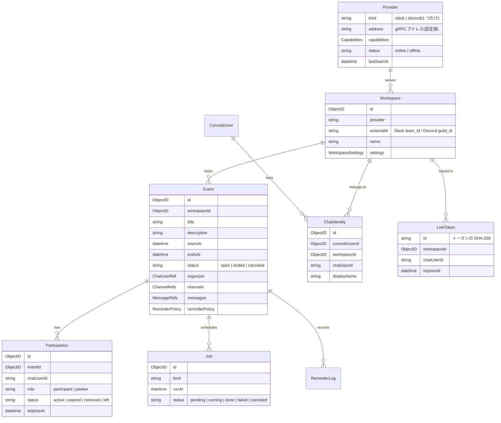
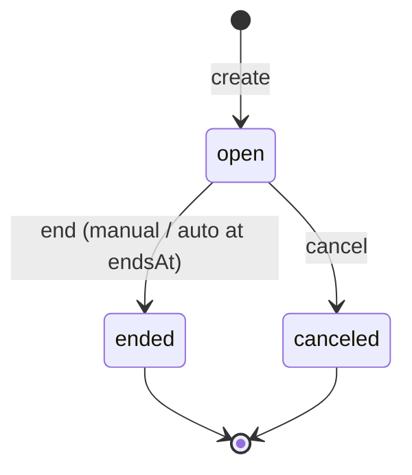

# 04. ドメインモデル

## 1. エンティティ関係



## 2. エンティティ定義

### 2.1 Provider(対になる Provider の状態)

Manager と 1:1 で対になる Provider の情報。`meta` コレクションの単一ドキュメントとして保持し、Manager が `GetInfo` の結果で更新する。資格情報は持たない(Provider の環境変数のみ)。

| フィールド | 型 | 説明 |
| --- | --- | --- |
| kind | `slack` \| `discord` | 初回接続時に記録し、以後不変。異なる種別の Provider が接続された場合は起動を中止する |
| address | string | `ASOBELL_PROVIDER_ADDR` の値(表示用) |
| capabilities | Capabilities | `{ forms, ephemeral, directMessage }`。Manager が返信手段・入力方式を決める際に参照 |
| version | string | Provider のビルドバージョン |
| botUserId | string | チャットツール上の Bot 自身のユーザー ID |
| connected | bool | Provider がチャットツールに接続できているか |
| status | `online` \| `offline` | `GetInfo` の連続失敗(3 回)または `connected: false` で `offline` |
| lastSeenAt | datetime | 直近の `GetInfo` 成功時刻 |

### 2.2 Workspace(ワークスペース)

Provider が接続した Slack Team / Discord Guild。Manager 起動時の `ListConnectedWorkspaces` と、Provider からの `ReportWorkspaces` RPC(Discord の Guild 参加時など)で upsert される。Slack は通常 1 件、Discord は Bot が参加する Guild の数だけ存在する。

| フィールド | 型 | 説明 |
| --- | --- | --- |
| id | ObjectID | |
| provider | string | Provider の種別(`meta.provider.kind` と同じ) |
| externalId | string | Slack `team_id` / Discord `guild_id` |
| name | string | チーム名 / サーバー名 |
| settings | WorkspaceSettings | §2.2.1 |
| createdAt / updatedAt | datetime | |

一意制約: `(provider, externalId)`。

#### 2.2.1 WorkspaceSettings

| フィールド | 型 | 既定値 | 説明 |
| --- | --- | --- | --- |
| recruitChannelId | string? | null | 募集チャンネル。null で無効 |
| timezone | string | `Asia/Tokyo` | IANA TZ 名。表示・日時入力の解釈に使用 |
| defaultReminderPolicy | ReminderPolicy | offsets `[168h, 24h, 3h]` | 新規イベントの既定 |
| peekDuration | duration | `1h` | チラ見の滞在時間 |
| autoEndGrace | duration | `24h` | `endsAt` 未設定時、`startsAt` からこの時間経過で自動終了 |
| discord.eventCategoryId | string? | null | イベントチャンネルを作る Discord カテゴリ |
| discord.archiveCategoryId | string? | null | アーカイブ時に移動する Discord カテゴリ(任意) |
| channelNamePrefix | string | `ev-` | イベントチャンネル名の prefix |
| defaultStartTime | `HH:MM` | `19:00` | チャット入力で時刻が省略されたときの開始時刻 |

### 2.3 Event(イベント)

| フィールド | 型 | 説明 |
| --- | --- | --- |
| id | ObjectID | |
| workspaceId | ObjectID | |
| title | string (1..80) | |
| description | string (0..1000) | |
| startsAt | datetime | 開始日時 |
| endsAt | datetime? | 終了予定。null の場合 `startsAt + autoEndGrace` が自動終了時刻 |
| location | string? | 場所(任意) |
| status | `open` \| `ended` \| `canceled` | |
| organizer | ChatUserRef | `{ userId, displayName }` |
| channel | ChannelRef | `{ channelId, name, archived bool }` イベントチャンネル |
| originChannelId | string | コマンドが実行された(立ち上げメッセージを投稿した)チャンネル |
| messages | MessageRefs | §2.3.1 |
| reminderPolicy | ReminderPolicy | §2.4 |
| participantCount | int | 非正規化した参加者数(表示用)。Participation から再計算可能 |
| endedAt | datetime? | 終了・中止日時 |
| endReason | `manual` \| `auto` \| `canceled` \| `provision_failed` \| `channel_lost`? | `provision_failed`: 作成時の Provider 失敗、`channel_lost`: イベントチャンネルが外部で削除された |
| createdVia | `chat` \| `console` | |
| createdBy | string | chat の場合 chatUserId、console の場合 ConsoleUser id |
| createdAt / updatedAt | datetime | |

#### 2.3.1 MessageRefs

| フィールド | 説明 |
| --- | --- |
| announcement | `{ channelId, messageId }` 立ち上げメッセージ(originChannel、ピン留め) |
| recruitAnnouncement | `{ channelId, messageId }?` 募集チャンネルへの告知(設定時のみ) |
| summary | `{ channelId, messageId }` イベントチャンネル内の概要メッセージ(ピン留め) |

Slack の messageId は `ts`、Discord は message snowflake。

#### 2.3.2 状態遷移



`ended` / `canceled` になった後は編集・参加・チラ見を受け付けない。アーカイブ処理はステータス遷移と同時に `archive_channel` ジョブとして非同期に実行され、完了で `channel.archived = true` となる。

### 2.4 ReminderPolicy(リマインドポリシー)

投稿ペースを 2 種類のモードで表現する。

```json
{ "mode": "offsets", "offsets": ["168h", "24h", "3h"] }
```

`startsAt` の各 offset 前に 1 回ずつ投稿する。過去になった offset は無視する。

```json
{ "mode": "interval", "every": "48h", "at": "20:00", "finalOffset": "3h" }
```

現在時刻以降、ワークスペース TZ の `at` 時刻に `every` 間隔で投稿し、最後に `startsAt - finalOffset` に 1 回投稿する。

```json
{ "mode": "none" }
```

リマインドしない。

制約: 生成されるリマインドは 1 イベントあたり最大 30 件。超過時はバリデーションエラー。

### 2.5 Participation(参加)

| フィールド | 型 | 説明 |
| --- | --- | --- |
| id | ObjectID | |
| eventId | ObjectID | |
| workspaceId | ObjectID | 非正規化 |
| chatUserId | string | Slack user_id / Discord user_id |
| displayName | string | 取得時点の表示名(表示用キャッシュ) |
| role | `participant` \| `peeker` | |
| status | `active` \| `expired` \| `removed` \| `left` | |
| joinedAt | datetime | |
| expiresAt | datetime? | peeker のみ |
| peekCount | int | チラ見した回数(再チラ見の判断用) |
| updatedAt | datetime | |

一意制約: `(eventId, chatUserId)`。1 ユーザー 1 レコードで、役割変更は同レコードの更新で行う。

#### 2.5.1 役割・状態遷移

| 現在 | 操作 | 結果 |
| --- | --- | --- |
| なし | 参加 | `participant/active`、チャンネル追加、参加メッセージ |
| なし | チラ見 | `peeker/active`、expiresAt = now + peekDuration、チャンネル追加、チラ見メッセージ、`peek_expire` ジョブ |
| peeker/active | 参加 | `participant/active`、expiresAt = null、`peek_expire` ジョブ取消、参加メッセージ |
| peeker/active | チラ見 | 何もしない(残り時間を ephemeral で案内) |
| participant/active | 参加 | 何もしない(参加済みを ephemeral で案内) |
| participant/active | チラ見 | 何もしない(参加済みを ephemeral で案内) |
| peeker/active | 期限到来 | `peeker/expired`、チャンネルから除外 |
| peeker/expired | 参加 / チラ見 | 「なし」と同じ扱い(再入場可) |
| participant/active | `/asobell leave` | `participant/left`、チャンネルから除外、退出メッセージ |
| any/active | WebConsole で除外 | `*/removed`、チャンネルから除外 |
| */left, */removed | 参加 / チラ見 | 「なし」と同じ扱い |

主催者は作成時に `participant/active` として登録され、`leave` できない(中止または終了で対応)。

### 2.6 Job(ジョブ)

非同期・時限処理を表す。永続化キューとして MongoDB を用いる(→ [11-scheduler.md](11-scheduler.md))。

| フィールド | 型 | 説明 |
| --- | --- | --- |
| id | ObjectID | |
| kind | string | §2.6.1 |
| runAt | datetime | 実行予定 |
| dedupeKey | string? | 同一ジョブの重複登録防止用(一意、sparse) |
| payload | object | kind ごとの内容 |
| status | `pending` \| `running` \| `done` \| `failed` \| `canceled` | |
| attempts | int | |
| maxAttempts | int | 既定 5 |
| leaseUntil | datetime? | running 時のリース期限 |
| lastError | string? | |
| eventId | ObjectID? | 検索・一括取消用 |
| createdAt / updatedAt / finishedAt | datetime | |

#### 2.6.1 kind 一覧

| kind | payload | 説明 |
| --- | --- | --- |
| `reminder` | `{ eventId, sequence, target: "both" }` | リマインド投稿 |
| `peek_expire` | `{ eventId, participationId }` | チラ見期限による除外 |
| `event_auto_end` | `{ eventId }` | 終了予定時刻での自動終了 |
| `archive_channel` | `{ eventId }` | チャンネルアーカイブ処理 |

### 2.7 ReminderLog(リマインド履歴)

| フィールド | 説明 |
| --- | --- |
| eventId, sequence | どのリマインドか |
| sentAt | |
| targets | `[{ channelId, messageId, kind: "event" \| "recruit", ok bool, error? }]` |

### 2.8 ConsoleUser(WebConsole 利用者)

| フィールド | 説明 |
| --- | --- |
| id | ObjectID |
| googleSub | Google の `sub` クレーム。一意 |
| email | |
| name, picture | 表示用 |
| createdVia | `link` \| `allowlist`。初回ログインの経路 |
| createdAt, lastLoginAt | |

### 2.9 ChatIdentity(チャット ID 連携)

Slack / Discord のユーザーと ConsoleUser の紐づけ。

| フィールド | 型 | 説明 |
| --- | --- | --- |
| id | ObjectID | |
| consoleUserId | ObjectID | |
| workspaceId | ObjectID | |
| provider | string | 非正規化 |
| workspaceExternalId | string | 非正規化(検索用) |
| chatUserId | string | Slack user_id / Discord user_id |
| displayName | string | 連携時点の表示名 |
| linkedAt | datetime | |

一意制約: `(workspaceId, chatUserId)`。1 チャットユーザーは 1 ConsoleUser にしか紐づかない。同じチャットユーザーを別の Google アカウントで連携しようとした場合は「既に別のアカウントと連携済み」として拒否し、先に `/asobell unlink` を求める。

### 2.10 LinkToken(連携トークン)

`/asobell login` で発行される一度きりのトークン。

| フィールド | 型 | 説明 |
| --- | --- | --- |
| id | string | トークン(`crypto/rand` 32 バイト、base64url)の SHA-256 hex。平文は保存しない |
| workspaceId | ObjectID | |
| chatUserId | string | |
| displayName | string | 連携ページでの表示用 |
| expiresAt | datetime | 発行から 10 分 |
| consumedAt | datetime? | 消費済みなら設定。TTL で自動削除 |

URL 形式: `<BASE_URL>/link/<token>`。GET はトークンを消費せず連携ページを表示するだけとし、消費はページ内の「連携する」ボタン(POST)で行う(リンクプレビューによる先取り消費を防ぐ)。

## 3. 値オブジェクトと不変条件

| 名前 | 不変条件 |
| --- | --- |
| Title | 1〜80 文字。前後空白を除去 |
| Description | 0〜1000 文字 |
| StartsAt | 作成時点で未来であること(編集時は緩和: 過去でも可だが警告) |
| EndsAt | 設定時は `startsAt` より後 |
| ReminderPolicy | offsets は重複なし・正の duration・最大 30 件。interval の `every` は 1h 以上、`at` は `HH:MM` |
| ChannelName | provider ごとの命名規則に正規化(→ [06-provider.md](06-provider.md) §4) |
| Duration | Go の `time.Duration` 文字列形式(`1h30m`)を JSON では文字列で扱う。チャット入力では `7d` のような `d` 単位も許容し、内部で `168h` へ変換する |
| LinkToken | 256 bit の乱数。URL には base64url、DB には SHA-256 で保存 |

## 4. ドメインイベント(内部)

Manager のユースケース完了時に内部通知として発火し、Provider へのメッセージ投稿・ジョブ登録を副作用として実行する。v1 ではイベントバスを設けず、ユースケース内で明示的に呼び出す(→ [02-architecture.md](02-architecture.md) §4)。

| ドメインイベント | 副作用 |
| --- | --- |
| EventCreated | チャンネル作成、告知投稿、ピン留め、リマインド/自動終了ジョブ登録(チャット・WebConsole どちらから作成しても同じ) |
| ParticipantJoined | チャンネル追加、参加メッセージ、告知メッセージ更新(参加者数) |
| PeekerJoined | チャンネル追加、チラ見メッセージ、`peek_expire` 登録 |
| PeekerExpired | チャンネル除外 |
| ParticipantLeft / Removed | チャンネル除外、退出メッセージ、告知更新 |
| EventUpdated | 告知・概要メッセージ更新、リマインドジョブ再生成 |
| EventEnded / EventCanceled | リマインド取消、ピン解除、ボタン無効化、終了メッセージ、`archive_channel` 登録 |
| LinkRequested | LinkToken 発行、連携 URL をエフェメラル(非対応なら DM)で返信 |
| IdentityLinked / IdentityUnlinked | 該当なし(WebConsole 表示のみ) |
