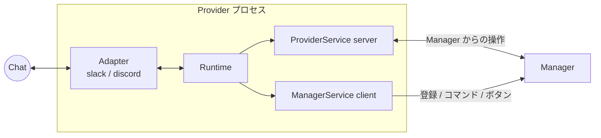

# 06. Provider 設計

## 1. 位置づけ

Provider は **1 つのチャットツール接続を担当する独立プロセス**で、対になる 1 つの Manager と gRPC で通信する(契約は [16-grpc.md](16-grpc.md))。Slack / Discord の差異は Provider プロセス内の `Adapter` 実装に閉じ込め、Manager は種別に関係なく同じ `ProviderService` を呼ぶ。



| 層 | 責務 |
| --- | --- |
| Adapter | チャットツール SDK を使った送受信。プラットフォーム固有形式 ⇄ `adapter` パッケージの共通型の変換 |
| Runtime | 起動・Manager との疎通確認、`ProviderService` の実装(Adapter へ委譲)、受信イベントの Manager への転送、ACK タイミング、エフェメラル → DM フォールバック、Health |
| Render | `asobell.v1.Message` / `Form` をプラットフォーム形式(Block Kit / Components)へ描画 |

## 2. Adapter インターフェース(Provider プロセス内)

```go
package adapter

type Adapter interface {
    Kind() asobellv1.ProviderKind
    Capabilities() asobellv1.Capabilities
    // Connect はチャットツールへ接続し、受信イベントを sink に流す。ブロックしない。
    Connect(ctx context.Context, sink InboundSink) error
    Close(ctx context.Context) error
    // BotUserID はチャットツール上の Bot 自身のユーザー ID。
    BotUserID() string
    // Workspaces は接続時点で判明しているワークスペース(Slack: auth.test の team、Discord: GuildCreate 済みの guild)。
    Workspaces() []WorkspaceInfo

    CreatePrivateChannel(ctx context.Context, ws WorkspaceRef, in CreateChannelInput) (ChannelInfo, error)
    AddMember(ctx context.Context, ws WorkspaceRef, channelID, userID string) error
    RemoveMember(ctx context.Context, ws WorkspaceRef, channelID, userID string) error
    ArchiveChannel(ctx context.Context, ws WorkspaceRef, channelID, archiveCategoryID string) (ChannelInfo, error)
    ListChannels(ctx context.Context, ws WorkspaceRef, cursor string, limit int) ([]ChannelInfo, string, error)

    PostMessage(ctx context.Context, ws WorkspaceRef, channelID string, msg *asobellv1.Message) (MessageRef, error)
    UpdateMessage(ctx context.Context, ws WorkspaceRef, ref MessageRef, msg *asobellv1.Message) error
    // PostEphemeral は本人にだけ見える投稿。非対応の Adapter は ErrUnsupported を返し、Runtime が DM にフォールバックする。
    PostEphemeral(ctx context.Context, ws WorkspaceRef, channelID, userID string, msg *asobellv1.Message) error
    SendDirectMessage(ctx context.Context, ws WorkspaceRef, userID string, msg *asobellv1.Message) (MessageRef, error)
    PinMessage(ctx context.Context, ws WorkspaceRef, ref MessageRef) error
    UnpinMessage(ctx context.Context, ws WorkspaceRef, ref MessageRef) error
    ResolveUser(ctx context.Context, ws WorkspaceRef, userID string) (UserInfo, error)
}

// InboundSink は Runtime が実装し、Adapter が受信イベントを渡す先。
type InboundSink interface {
    // OnCommand は 3 秒以内に返る必要がある。reply が nil でなければ Adapter は即時応答としてそれを描画する。
    OnCommand(ctx context.Context, cmd Command) (*asobellv1.Reply, error)
    OnAction(ctx context.Context, act Action) (*asobellv1.Reply, error)
    OnFormSubmit(ctx context.Context, sub FormSubmission) (*asobellv1.Reply, error)
    OnWorkspaceDiscovered(ctx context.Context, ws WorkspaceInfo)
    OnConnectionStateChanged(connected bool, err error)
}
```

`Command` / `Action` / `FormSubmission` は proto の同名メッセージと同じフィールドに加え、Adapter 固有の応答ハンドル(`Responder`)を持つ。

```go
type Responder interface {
    // Ack はプラットフォームへの即時応答(Slack: Ack payload、Discord: InteractionRespond)。1 回だけ呼べる。
    Ack(ctx context.Context, reply *asobellv1.Reply) error
    // Followup は Ack 後の追加応答(Slack: response_url / postEphemeral、Discord: FollowupMessageCreate / InteractionResponseEdit)。
    Followup(ctx context.Context, reply *asobellv1.Reply) error
    // OpenForm はフォームを開く(Slack: views.open with trigger_id)。forms 非対応なら ErrUnsupported。
    OpenForm(ctx context.Context, form *asobellv1.Form) error
}
```

### 2.1 エラー

Adapter は以下のセンチネルを `errors.Is` で判定可能な形で返す。Runtime が gRPC ステータス + `ErrorInfo` に変換する(対応表は [16-grpc.md](16-grpc.md) §3)。

`ErrNotFound`, `ErrAlreadyMember`, `ErrNotMember`, `ErrNameTaken`, `ErrPermission`, `ErrRateLimited`, `ErrPinLimit`, `ErrUnavailable`, `ErrUnsupported`, `ErrDMBlocked`(ユーザーが DM を拒否)。

## 3. Runtime の挙動

### 3.1 インバウンド処理と ACK

| イベント | Runtime の手順 |
| --- | --- |
| スラッシュコマンド(Slack) | ① `Responder.Ack(nil)` を即時。② `HandleCommand`(デッドライン: `new`/`edit` は 2.5s、それ以外 25s)。③ `Reply.open_form` があれば `OpenForm`、それ以外は `Followup` |
| スラッシュコマンド(Discord) | ① `Ack` を Deferred(ephemeral)で即時。② `HandleCommand`(25s)。③ `Followup`(InteractionResponseEdit) |
| ボタン | ① `Ack`(Slack: 空 Ack、Discord: DeferredMessageUpdate)。② `HandleAction`(25s)。③ `Followup` を ephemeral で |
| フォーム送信 | ① `HandleFormSubmit`(2.5s)。② `form_errors` があれば `Ack(errors)`、なければ `Ack(clear)`。③ 追加の返信は Manager が後から `PostEphemeral` RPC で行う |

Manager に到達できない(`UNAVAILABLE` / デッドライン超過)場合は固定文言「ただいま利用できません。しばらくしてからお試しください」を ephemeral で返し、エラーをログに出す。

### 3.2 エフェメラル → DM フォールバック

`Reply.visibility == EPHEMERAL` または `PostEphemeral` RPC に対して:

1. Adapter の `PostEphemeral` を試みる
2. `ErrUnsupported`、`ErrNotFound`(Slack `channel_not_found` / `not_in_channel` / `user_not_in_channel`)の場合、`SendDirectMessage` へフォールバックし、`delivered_via_dm: true` を返す。元のチャンネルへの「DM を送りました」という通知は行わない。Discord ではインタラクション外に本人だけ見える投稿手段が無く、公開投稿にすると「その人に個別の連絡が行った」ことが他の参加者に見えてしまうため
3. DM も失敗(`ErrDMBlocked`)した場合はエラーを Manager に返す(`FAILED_PRECONDITION` / `DM_BLOCKED`)。Manager は連携 URL のような機微な内容を公開チャンネルへは投稿しない

Slack で `channel_id` が `D` 始まり(Bot との DM 内)なら、最初から通常投稿で返す。

### 3.3 起動と状態

- 起動時に `ReportWorkspaces`(空でもよい)で Manager との疎通を確認する(成功まで 1s〜30s の指数バックオフ)。成功してから `Adapter.Connect`
- `GetInfo` は Manager からの状態監視に応答し、`connected` に Adapter の接続状態を返す
- Adapter の接続状態が変わったら gRPC Health を `SERVING` / `NOT_SERVING` に切り替える
- Manager からの `ListConnectedWorkspaces` には `Adapter.Workspaces()` を返す

## 4. チャンネル名の正規化

Manager が `internal/shared/channelname` で `<prefix><MMDD>-<slug>` に正規化して `CreatePrivateChannel.name` に渡し、Adapter はプラットフォームの最終制約(長さ、文字種)だけを適用する。

1. タイトルを Unicode NFKC 正規化し小文字化する
2. 空白と `/` を `-` に置換し、連続する `-` は 1 つにまとめる
3. Slack で不可の文字(大文字、空白、ピリオド)を除去する。日本語文字は残す
4. 先頭に `<prefix>` と開始日 `MMDD-` を付与し、80 文字(Slack)/ 90 文字(Discord、`archived_` 9 文字分の余裕)に切り詰める
5. `ErrNameTaken` は Manager が `-2`, `-3` を付与して最大 3 回再試行する

例: タイトル「ボドゲ会 @渋谷」、開始 9/20、prefix `ev-` → `ev-0920-ボドゲ会-渋谷`。

## 5. メッセージモデルと描画

`asobell.v1.Message`(text / sections / buttons / suppress_preview)を各 Adapter が描画する。本文は Provider 非依存の最小マークアップで、`internal/shared/markup` がトークン化し、Adapter が変換する。

| 記法 | 意味 | Slack | Discord |
| --- | --- | --- | --- |
| `{{user:ID}}` | ユーザーメンション | `<@ID>` | `<@ID>` |
| `{{channel:ID}}` | チャンネルリンク | `<#ID>` | `<#ID>` |
| `{{time:UNIX}}` | 時刻(閲覧者の TZ で表示) | `<!date^UNIX^{date_short_pretty} {time}\|fallback>` | `<t:UNIX:F>` |
| `**text**` | 太字 | `*text*` | `**text**` |
| `{{url:URL\|label}}` | リンク | `<URL\|label>` | `[label](URL)` 形式のマークダウンリンク(Bot メッセージで許容) |

Discord の本文 2000 文字、Slack の section 3000 文字を超える場合は Adapter 側で切り詰め、末尾に `…` を付ける。`suppress_preview` は Slack `unfurl_links=false, unfurl_media=false`、Discord `SUPPRESS_EMBEDS` に対応する。

ボタン ID は `asobell:<action>:<eventId>`(Slack `action_id`、Discord `custom_id`)。

### 5.1 Form の描画

| FieldType | Slack (Block Kit) | Discord |
| --- | --- | --- |
| TEXT | `plain_text_input` | (Discord は v1 でフォーム非対応: `forms=false`) |
| MULTILINE_TEXT | `plain_text_input` multiline | – |
| DATE | `datepicker` | – |
| TIME | `timepicker` | – |
| SELECT | `static_select` | – |

Discord のモーダルにはテキスト入力しかなく日付ピッカーが無いため、v1 の Discord Provider は `forms=false` を申告し、Manager は Discord に対してはコマンド引数(`title:` `when:` …)で入力を受ける。

## 6. Slack Adapter (`internal/provider/slack`)

| 項目 | 実装 |
| --- | --- |
| 接続 | Socket Mode(`socketmode.Client`)。`Connect` で goroutine を起動し `client.RunContext(ctx)` |
| ACK | 受信直後に `client.Ack(*evt.Request, payload)`。`Responder.Ack` に対応 |
| Followup | コマンド: `PostEphemeral`(`chat.postEphemeral`、`unfurl` 抑止可)。`response_url` 経由は slack-go が `unfurl_links` を送らないため、連携 URL のようなプレビュー抑止が必要な返信には使わない |
| コマンド | `/asobell <subcommand> [args]` の 1 コマンド。`Text` を空白分割し `args` を構築 |
| フォーム | `views.open`(`trigger_id`)。`private_metadata` に `Form.metadata` |
| ワークスペース | `auth.test` の `TeamID` / `Team`。Enterprise Grid の org-install では `enterprise_id + team_id` で識別(v1 は単一 team 前提) |
| チャンネル作成 | `CreateConversation(CreateConversationParams{IsPrivate: true})`。作成者 Bot は自動でメンバー |
| メンバー追加 | `InviteUsersToConversation`。`already_in_channel` → `ErrAlreadyMember` |
| メンバー除外 | `KickUserFromConversation`。`not_in_channel` → `ErrNotMember` |
| アーカイブ | `ArchiveConversation`。`already_archived` は成功扱い。unarchive は bot token 不可のため非対応 |
| ピン | `AddPin` / `RemovePin`。`too_many_pins` → `ErrPinLimit` |
| メッセージ | `PostMessage(MsgOptionBlocks, MsgOptionText)`、`UpdateMessage` |
| エフェメラル | `PostEphemeralContext(channel, user, MsgOptionDisableLinkUnfurl(), MsgOptionDisableMediaUnfurl())`。`channel_not_found` / `not_in_channel` / `user_not_in_channel` → `ErrNotFound` |
| DM | `OpenConversationContext(&OpenConversationParameters{Users: [uid]})` → `PostMessageContext`。`user_disabled` / `user_not_visible` → `ErrDMBlocked` |
| ユーザー | `GetUserInfo`。表示名は `Profile.DisplayName` → `RealName` → `Name` |
| レート制限 | `slack.OptionRetry(3)`。それでも `*slack.RateLimitedError` なら `ErrRateLimited` |
| Capabilities | `forms=true, ephemeral=true, direct_message=true` |

必要スコープ: `commands`, `chat:write`, `channels:manage`, `channels:read`, `groups:write`, `groups:read`, `im:write`, `pins:write`, `users:read`。App-Level Token に `connections:write`。マニフェストは [12-config-deploy.md](12-config-deploy.md) §6。

## 7. Discord Adapter (`internal/provider/discord`)

| 項目 | 実装 |
| --- | --- |
| 接続 | Gateway(`discordgo.Session.Open`)。Intents は `IntentsGuilds` |
| コマンド | `/asobell` に subcommand を持つ 1 コマンドを `ApplicationCommandBulkOverwrite` で各 Guild に登録。`Contexts: [InteractionContextGuild]`、`IntegrationTypes: [ApplicationIntegrationGuildInstall]` で Guild 内に限定(DM からの実行を防ぎ、`guild_id` でワークスペースを特定できる) |
| ACK | `InteractionRespond`。コマンドは `DeferredChannelMessageWithSource`(ephemeral)、ボタンは `DeferredMessageUpdate` |
| Followup | `InteractionResponseEdit` / `FollowupMessageCreate(WebhookParams{Flags: Ephemeral \| SuppressEmbeds})` |
| フォーム | 非対応(`forms=false`)。引数で受ける |
| ワークスペース | `GuildCreate` で `OnWorkspaceDiscovered` |
| チャンネル作成 | `GuildChannelCreateComplex` + `PermissionOverwrite`(`@everyone` deny `VIEW_CHANNEL`、Bot と主催者 allow)。`ParentID` = category |
| メンバー追加 | `ChannelPermissionSet(channel, user, Member, VIEW_CHANNEL\|SEND_MESSAGES\|READ_MESSAGE_HISTORY, 0)` |
| メンバー除外 | `ChannelPermissionDelete`。overwrite 無しは `ErrNotMember` |
| アーカイブ | `ChannelEdit(&ChannelEdit{Name: "archived_" + name, ParentID: archiveCategory})`。既に prefix 付きなら成功扱い |
| ピン | `ChannelMessagePin` / `ChannelMessageUnpin`。`PIN_MESSAGES`(1<<51)は自前定義 |
| メッセージ | `ChannelMessageSendComplex(MessageSend{Content, Components, Flags})`、`ChannelMessageEditComplex` |
| エフェメラル | インタラクション応答(`Flags: Ephemeral \| SuppressEmbeds`)でのみ可能。インタラクション文脈外の `PostEphemeral` RPC(Manager からの後追い通知)は `ErrUnsupported` → DM フォールバック |
| DM | `UserChannelCreate(userID)` → `ChannelMessageSendComplex(Flags: SuppressEmbeds)`。REST エラー `50007` → `ErrDMBlocked`、`40003` → `ErrRateLimited` |
| ユーザー | `GuildMember(guildID, userID).DisplayName()` |
| レート制限 | discordgo が 429 を自動再試行するため、すべての呼び出しに `discordgo.WithContext(ctx)` でタイムアウト付き ctx を渡す |
| Capabilities | `forms=false, ephemeral=true, direct_message=true` |

Discord の「エフェメラル」はインタラクションへの応答としてのみ存在する。Manager がフォーム送信後などに後追いで本人向け通知を送る場合(`PostEphemeral` RPC)、Discord Adapter は DM で送る。Discord では `HandleCommand` が同期的に完了してから `Followup` するため、通常この経路は使わない。

Bot 招待 URL と権限ビット(`2251800082169872`)、制約(overwrite 上限、ピン 250、本文 2000 文字)は変更なし。

## 8. Fake Adapter / Fake ProviderService (`internal/provider/fake`)

- `fake.Adapter`: インメモリの Adapter。チャンネル・メンバー・メッセージ・ピンを map で保持し、呼び出し履歴と `FailNext(method, err)` を備える。Runtime のテストに使う。`internal/provider/adaptertest` の契約テスト(冪等性、センチネルエラー)を通す
- `fake.Responder`: `Ack` / `Followup` / `OpenForm` の呼び出し順を記録する Responder。Runtime の ACK 制御の検証に使う
- `fake.ManagerServer`: `ManagerServiceServer` のインメモリ実装。`bufconn` 上で起動し、Runtime のテストに使う
- `fake.ProviderServer`: `ProviderServiceServer` のインメモリ実装。`bufconn` 上で起動し、Manager の Usecase / Job のテストに使う。Adapter ではなく gRPC サーバーのフェイクであり、失敗の差し込みも gRPC ステータスで行うため契約テストは共有しない。Runtime を通した bufconn テストで、Adapter 側と同じ振る舞いになることを確かめる

## 9. Provider の追加手順(将来)

1. `internal/provider/<kind>` に `Adapter` を実装する
2. `cmd/provider-<kind>/main.go` で `app.Run(adapter)` を呼ぶ
3. `ProviderKind` enum に値を追加する(Manager 側は enum 値の追加のみで対応)
4. 描画(`render`)にプラットフォーム変換を追加する
