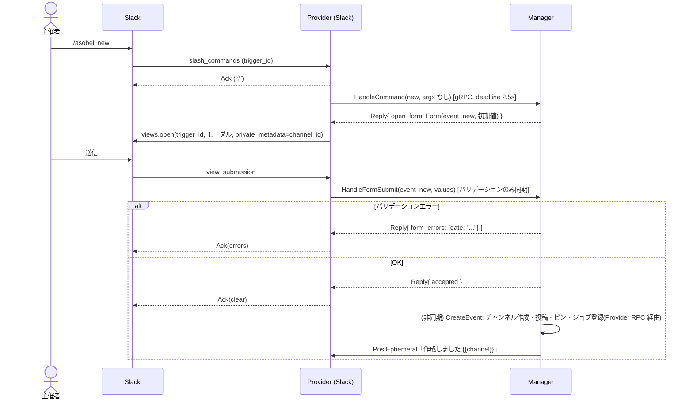
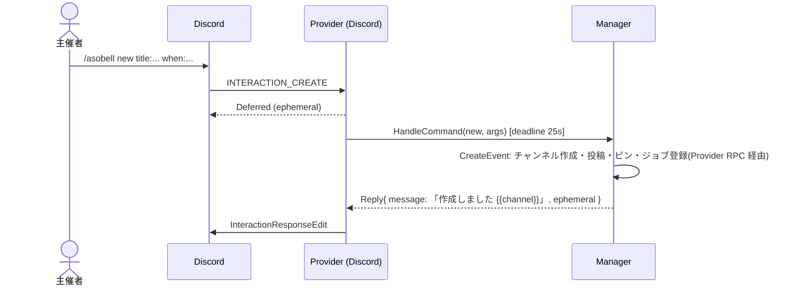
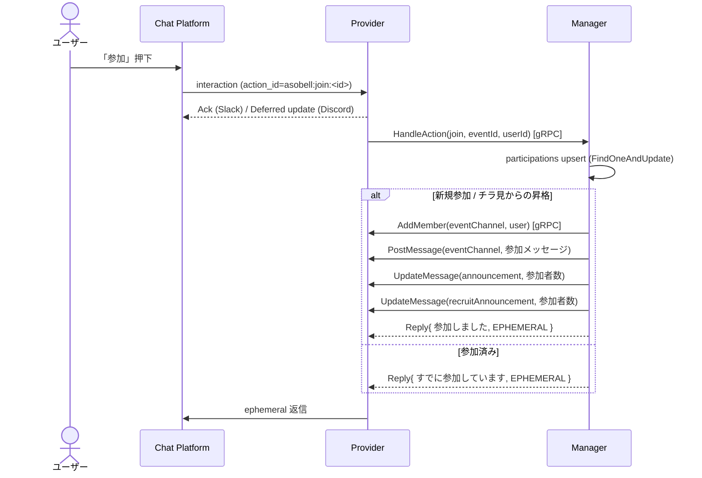
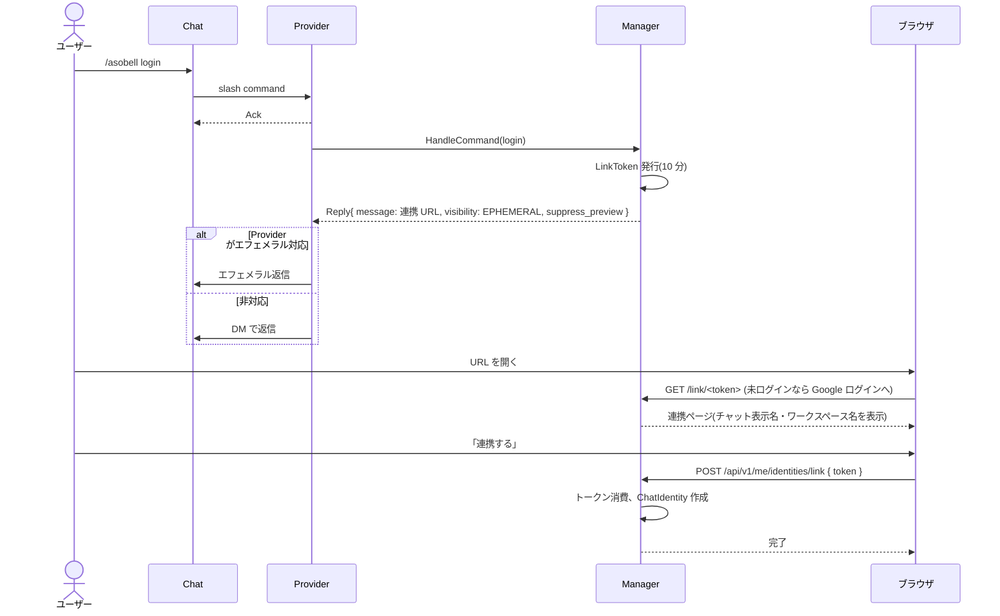

# 07. Bot コマンド・対話設計

## 1. コマンド体系

Slack / Discord とも、単一のトップレベルコマンド `/asobell` にサブコマンドを持たせる。

| サブコマンド | 実行場所 | 説明 | 権限 |
| --- | --- | --- | --- |
| `new` | 任意のチャンネル | イベントを立ち上げる。実行チャンネルが立ち上げメッセージの投稿先(originChannel)になる | 誰でも |
| `edit` | イベントチャンネル | タイトル・日時・説明・終了予定を編集する | 主催者 |
| `remind <pace>` | イベントチャンネル | リマインドペースを設定する | 主催者 |
| `end` | イベントチャンネル | イベントを終了する | 主催者 |
| `cancel` | イベントチャンネル | イベントを中止する | 主催者 |
| `leave` | イベントチャンネル | イベントから抜ける | 参加者(主催者以外) |
| `info` | イベントチャンネル | イベント情報と参加者を表示する(ephemeral) | 誰でも |
| `list` | 任意のチャンネル | 募集中イベント一覧を表示する(ephemeral) | 誰でも |
| `recruit set` | 任意のチャンネル | 実行チャンネルを募集チャンネルにする | 誰でも(v1 は権限区別なし) |
| `recruit clear` | 任意のチャンネル | 募集チャンネル設定を解除する | 誰でも |
| `login` | 任意 | WebConsole との連携用 URL を本人にだけ返す(→ §5) | 誰でも |
| `unlink` | 任意 | 連携を解除する | 連携済みの本人 |
| `help` | 任意 | 使い方を表示する(ephemeral) | 誰でも |

コマンドの解釈と返信文言の組み立ては Manager 側の Bot Core が行う。Provider は受信したコマンドを正規化して `HandleCommand` RPC で Manager に渡し、返ってきた `Reply`(メッセージ、可視性、フォーム定義)をプラットフォーム形式で描画する(→ [16-grpc.md](16-grpc.md))。

「イベントチャンネル」で実行するコマンドは、実行チャンネル ID から `events.channel.channelId` を引いてイベントを特定する。該当がなければ「イベントチャンネルで実行してください」と ephemeral で返す。

### 1.1 Slack の引数

Slack は `/asobell` コマンド 1 つで、`Text` をサブコマンドと引数に分割する。

```text
/asobell new                       → モーダルを開く
/asobell remind 7d,1d,3h           → offsets モード
/asobell remind every 2d 20:00     → interval モード(finalOffset は既定 3h)
/asobell remind off                → none モード
/asobell edit                      → 現在値が入ったモーダルを開く
```

### 1.2 Discord のオプション

Discord は subcommand とオプションで受け取る(日付型オプションは存在しないため文字列)。

```text
/asobell new title:<string,必須,80> when:<string,必須> description:<string> ends:<string> remind:<string>
/asobell edit title: when: description: ends:
/asobell remind pace:<string,必須>
/asobell end | cancel | leave | info | list | help
/asobell recruit action:<set|clear>
```

`when` / `ends` の受理形式(ワークスペース TZ で解釈):

| 入力例 | 解釈 |
| --- | --- |
| `2026-09-20 19:00` | 絶対日時 |
| `9/20 19:00` | 今年(過去なら翌年) |
| `9/20` | 当日 00:00 は不自然なため `19:00` を既定時刻とする(ワークスペース設定 `defaultStartTime`、既定 `19:00`) |
| `tomorrow 19:00` / `明日 19:00` | 相対 |
| `+3h`(`ends` のみ) | 開始からの相対 |

パース失敗時はエラーメッセージに受理形式を含めて ephemeral で返す。

## 2. イベント作成フロー

### 2.1 Slack(モーダル)



Slack の `trigger_id` は 3 秒で失効するため、`HandleCommand` の gRPC デッドラインは 2.5 秒とし、Manager はフォーム定義を DB 参照 1 回程度で即時返す。Manager 側の `Form` 定義は Provider 非依存で、Slack Provider が Block Kit のモーダルへ変換する。

モーダル `event_new` の入力:

| block_id | 要素 | 必須 | 備考 |
| --- | --- | --- | --- |
| `title` | plain_text_input (max 80) | ✓ | |
| `date` | datepicker | ✓ | 初期値: 明日 |
| `time` | timepicker | ✓ | 初期値: 19:00 |
| `ends` | plain_text_input | | `+3h` または `HH:MM` または `MM/DD HH:MM` |
| `description` | plain_text_input (multiline, max 1000) | | |
| `remind` | static_select | | `標準(7日前/1日前/3時間前)`, `前日と3時間前`, `毎日20時`, `なし`, `カスタム(後で /asobell remind)` |

### 2.2 Discord(オプション)



Discord は Deferred 応答後 15 分以内に編集できるため、チャンネル作成まで同期で待ってから結果を返す。Manager が `CreateEvent` の途中で同じ Provider に `CreatePrivateChannel` 等の RPC を発行するため、Provider は受信ハンドラと gRPC サーバーを同時に処理できる必要がある(goroutine 分離)。

### 2.3 作成処理(Manager.CreateEvent)の手順

チャット(`HandleCommand` / `HandleFormSubmit`)からでも WebConsole(`POST /api/v1/events`)からでも同じ関数を呼ぶ。WebConsole からの場合、主催者はログインユーザーの当該ワークスペースにおける ChatIdentity(未連携ならエラー)。

1. 入力バリデーション(ドメイン層)。ワークスペースを担当する Provider が `online` でなければ `provider_unavailable`
2. `events` に `status: open` で挿入(channel/messages は空)
3. 主催者を `participant/active` で `participations` に登録
4. Provider: プライベートチャンネル作成(主催者をメンバーに含める)。`ErrNameTaken` は最大 3 回サフィックス付与で再試行
5. Provider: originChannel へ立ち上げメッセージを投稿し、ピン留め
6. 募集チャンネルが設定され originChannel と異なる場合、同内容を募集チャンネルへ投稿(ピン留めはしない)
7. Provider: イベントチャンネルへ概要メッセージを投稿し、ピン留め
8. `events` を `$set` で channel / messages で更新
9. リマインドジョブと自動終了ジョブを登録
10. 4〜7 のいずれかで失敗した場合: 作成済みの資源を可能な範囲で片付け(チャンネルがあればアーカイブジョブ登録)、`status: canceled`, `endReason: provision_failed` に更新し、主催者へエラーを ephemeral で通知

ピン留め失敗(`ErrPinLimit`, `ErrPermission`)は警告ログのみで処理を続行する。

## 3. メッセージ文言

文言は `internal/bot/messages.go` に集約し、テンプレート関数で組み立てる(将来の多言語化に備える)。以下は v1 の日本語文言。

### 3.1 立ち上げメッセージ(originChannel / 募集チャンネル)

```text
🔔 **{{title}}** の参加者を募集中!
📅 {{time:startsAt}}{{if endsAt}} 〜 {{time:endsAt}}{{end}}
{{if location}}📍 {{location}}{{end}}
👤 主催: {{user:organizer}}
🙋 参加者: {{participantCount}} 人
{{if description}}
{{description}}
{{end}}
連絡は {{channel:eventChannel}} で行います。

[ 参加 ] [ チラ見(1時間) ]
```

`参加` は Primary、`チラ見(1時間)` は Default スタイル。参加者数の増減、編集、終了で `UpdateMessage` する。終了・中止後はボタンを `Disabled` にし、先頭行を `✅ 終了しました` / `🚫 中止になりました` に置き換える。

### 3.2 概要メッセージ(イベントチャンネル、ピン留め)

```text
📌 **{{title}}**
📅 {{time:startsAt}}{{if endsAt}} 〜 {{time:endsAt}}{{end}}
{{if location}}📍 {{location}}{{end}}
👤 主催: {{user:organizer}}
{{description}}

主催者は `/asobell edit` `/asobell remind` `/asobell end` `/asobell cancel` で管理できます。
参加をやめるときは `/asobell leave`。
```

### 3.3 参加 / チラ見 / 退出メッセージ(イベントチャンネル)

| 契機 | 文言 |
| --- | --- |
| 参加 | `🙋 {{user}} が参加しました!(参加者 {{n}} 人)` |
| チラ見 | `👀 {{user}} がチラ見中です({{time:expiresAt}} まで)` |
| チラ見→参加 | `🙋 {{user}} がチラ見から参加に切り替えました!(参加者 {{n}} 人)` |
| チラ見期限 | (投稿しない。除外のみ) |
| 退出 | `👋 {{user}} が抜けました(参加者 {{n}} 人)` |
| WebConsole から除外 | `👋 {{user}} は主催者により参加を解除されました` |

### 3.4 ボタン押下時の ephemeral 返信

| 状況 | 文言 |
| --- | --- |
| 参加成功 | `参加しました! {{channel}} で連絡を待ってね` |
| チラ見成功 | `{{channel}} を 1 時間だけ覗けます({{time:expiresAt}} まで)。気に入ったら「参加」を押してね` |
| 参加済み | `すでに参加しています` |
| チラ見中に再度チラ見 | `チラ見中です({{time:expiresAt}} まで)。参加するなら「参加」を押してね` |
| イベント終了済み | `このイベントは終了しています` |
| Provider エラー | `チャンネルへの追加に失敗しました。時間をおいて再度お試しください` |

### 3.5 リマインド

イベントチャンネル向け:

```text
⏰ **{{title}}** まであと {{remaining}}!
📅 {{time:startsAt}}{{if location}} 📍 {{location}}{{end}}
{{mentions of active participants}}
```

募集チャンネル向け(ボタン付き):

```text
⏰ **{{title}}** まであと {{remaining}}!参加者 {{n}} 人
📅 {{time:startsAt}}{{if location}} 📍 {{location}}{{end}}
👤 主催: {{user:organizer}}

[ 参加 ] [ チラ見(1時間) ]
```

`remaining` は「7 日」「23 時間」「45 分」のように最大単位 1 つで丸める。

### 3.6 終了 / 中止

イベントチャンネル:

```text
✅ **{{title}}** は終了しました。おつかれさまでした!このチャンネルはアーカイブされます。
```

```text
🚫 **{{title}}** は中止になりました。このチャンネルはアーカイブされます。
```

## 4. ボタン処理フロー(参加)



`HandleAction` の処理中に Manager が同じ Provider へ RPC を発行する(相互呼び出し)。Provider は gRPC サーバーとしての受信を、インバウンド処理とは別の goroutine で捌く。

チラ見は `AddMember` 後に `peek_expire` ジョブを登録する点のみ異なる。

## 5. アカウント連携(`/asobell login`)



返信文言:

```text
🔗 WebConsole と連携するには、10 分以内に次の URL を開いてください(この URL はあなた専用で一度だけ使えます)
<BASE_URL>/link/<token>
```

既に連携済みの場合:

```text
✅ すでに {{email}} と連携済みです。WebConsole: <BASE_URL>
連携を解除するには /asobell unlink
```

- Slack は `unfurl_links: false`、Discord は `SUPPRESS_EMBEDS` フラグでリンクプレビューを抑止する
- トークンはエフェメラル/DM 以外には決して投稿しない。Provider がエフェメラルにも DM にも対応しない場合、Manager は `Reply` を返さず「この環境では連携できません」を通常返信する

## 6. 権限チェック

| 操作 | 許可される者 |
| --- | --- |
| edit / remind / end / cancel | 主催者。WebConsole からは誰でも |
| leave | 主催者以外のアクティブ参加者 |
| recruit set / clear | 誰でも(v1)。将来ワークスペース管理者に限定できるよう Manager 層に `Actor` を渡す |
| login / unlink | 本人のみ(コマンド実行者自身の連携) |

権限エラーは ephemeral で `この操作は主催者のみ実行できます` と返す。

## 7. ヘルプ

```text
あそベル の使い方
/asobell new                … イベントを立ち上げる(このチャンネルに募集を投稿)
/asobell list               … 募集中のイベント一覧
/asobell recruit set|clear  … このチャンネルを募集チャンネルにする / 解除
/asobell login              … WebConsole と連携する URL を受け取る
/asobell unlink             … 連携を解除する
-- イベントチャンネル内で --
/asobell info               … イベント情報
/asobell edit               … 内容を編集(主催者)
/asobell remind 7d,1d,3h    … リマインド設定(主催者)
/asobell remind every 2d 20:00
/asobell remind off
/asobell end                … 終了(主催者)
/asobell cancel             … 中止(主催者)
/asobell leave              … 参加をやめる
```

## 8. エッジケース

| ケース | 挙動 |
| --- | --- |
| 立ち上げメッセージが削除された | Update 時 `ErrNotFound` を無視。参加ボタンは募集チャンネル側またはリマインドから押せる |
| イベントチャンネルが手動で削除・アーカイブされた | 参加操作時に `ErrNotFound` → 主催者へ通知、イベントは `ended`(`endReason: channel_lost`)へ |
| 主催者がワークスペースを離脱 | 何もしない。WebConsole から終了できる |
| 同一ユーザーが複数イベントに参加 | 制限なし |
| 開始時刻が過去のイベントを `new` | 拒否(`開始日時は未来を指定してください`) |
| Discord で Bot の権限不足 | `ErrPermission` → `Bot に「チャンネルの管理」「ロールの管理」「メッセージのピン留め」権限が必要です` |
| Slack でプライベートチャンネル作成が制限されている | `ErrPermission` → `ワークスペース設定でチャンネル作成が制限されています` |
| Provider が Manager に接続できない | Provider はコマンドに `ただいま利用できません。しばらくしてからお試しください` を返す(Provider 内蔵の固定文言) |
| Manager が Provider を呼び出せない(offline) | チャット操作は届かないので該当なし。WebConsole 操作は `503 provider-unavailable` |
| 連携 URL を 10 分以内に開かなかった | 連携ページで「期限切れです。もう一度 /asobell login を実行してください」 |
| 別の Google アカウントで連携済みのチャットユーザーが再連携 | 連携ページで拒否。`/asobell unlink` を案内 |
