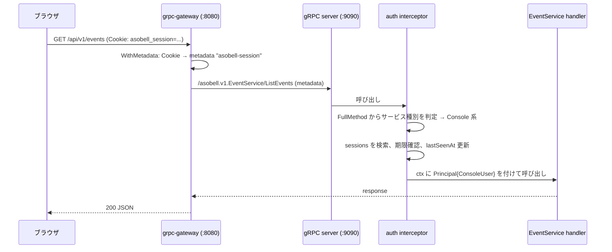

# 10. 認証・セキュリティ設計

## 0. 責務の分担

| 担当 | 責務 |
| --- | --- |
| Manager(`internal/manager/auth`) | Google OIDC のフロー(`/auth/google/login`, `/auth/google/callback`)、セッションの発行・検証・失効、連携トークン、gRPC 認証インターセプタ |
| Manager(`internal/manager/gateway`) | Cookie → gRPC メタデータの変換、`Set-Cookie` の転送、CSRF・セキュリティヘッダのミドルウェア |
| フロントエンド | なし。Manager が発行した HttpOnly Cookie をブラウザが保持し、`fetch` が自動送信する。トークンの値を読まず、認証ライブラリも持たない |
| Provider | 共有トークン(`ASOBELL_RPC_TOKEN`)を gRPC メタデータに付けるだけ |

## 1. WebConsole 認証(Google OIDC)

### 1.1 フロー

```mermaid
sequenceDiagram
    participant B as ブラウザ
    participant A as asobell
    participant G as Google
    B->>A: GET /auth/google/login?redirect=/events
    A->>A: state, PKCE verifier 生成 → oauth_states に保存(TTL 10分)
    A-->>B: 302 accounts.google.com/o/oauth2/v2/auth?...&state&code_challenge
    B->>G: 認証
    G-->>B: 302 /auth/google/callback?code&state
    B->>A: GET /auth/google/callback
    A->>A: state を oauth_states から取得・削除
    A->>G: code + verifier で token 交換
    G-->>A: id_token
    A->>A: id_token 検証(署名, iss, aud, exp), email_verified, 許可リスト
    A->>A: console_users upsert, sessions 作成
    A-->>B: Set-Cookie asobell_session; 302 /events
```

### 1.2 実装要点

- `oidc.NewProvider(ctx, "https://accounts.google.com")` を起動時に 1 回生成し、`provider.Verifier(&oidc.Config{ClientID})` を保持する
- `oauth2.Config{Scopes: [oidc.ScopeOpenID, "email", "profile"]}`
- PKCE: `oauth2.GenerateVerifier()` → `AuthCodeURL(state, oauth2.S256ChallengeOption(v))` → `Exchange(ctx, code, oauth2.VerifierOption(v))`
- クレーム: `sub`(永続 ID)、`email`、`email_verified`、`name`、`picture`、`hd`
- `email_verified == true` を必須とする
- アカウント作成の可否(初回ログイン時のみ判定。既存 `console_users` は常にログイン可):
  1. `redirect` が `/link/<token>` で、そのトークンが有効(未消費・期限内) → 作成(`createdVia: link`)
  2. `ASOBELL_ALLOWED_EMAILS` / `ASOBELL_ALLOWED_DOMAINS`(任意設定)に一致 → 作成(`createdVia: allowlist`)
  3. いずれでもない → `console_users` を作成せず `/login?error=forbidden` へ 302
- `redirect` パラメータは `/` で始まる相対パスのみ許可(オープンリダイレクト防止)

「Bot が導入されたワークスペースのメンバーであること」を WebConsole の認可根拠とするため、通常は連携 URL 経由で初回ログインする。許可リストは、チャット連携なしで運用画面を見たい管理者向けの補助手段であり、未設定でもよい。

### 1.3 チャットアカウント連携

```mermaid
sequenceDiagram
    participant U as ユーザー
    participant Chat as Slack/Discord
    participant M as Manager
    participant B as ブラウザ
    U->>Chat: /asobell login
    Chat->>M: (Provider 経由) HandleCommand(login)
    M->>M: token = rand(32B); link_tokens に sha256(token) を保存(10 分)
    M-->>Chat: エフェメラル(非対応なら DM)で <BASE_URL>/link/<token>
    U->>B: URL を開く
    B->>M: GET /link/<token>(SPA)→ GET /api/v1/link-tokens/<token>
    alt 未ログイン
        M-->>B: 401 → /login?redirect=/link/<token> → Google → callback
        M->>M: トークン有効なら console_users 作成を許可
    end
    B-->>U: 連携ページ(ワークスペース名・表示名を表示)
    U->>B: 「連携する」
    B->>M: POST /api/v1/me/identities/link { token }
    M->>M: FindOneAndUpdate(consumedAt: null → now)、chat_identities 挿入
    M-->>B: 201
```

- トークン: `crypto/rand` 32 バイト → base64url(43 文字)。DB には SHA-256 のみ保存し、URL の平文はチャットのエフェメラル/DM にしか現れない
- 有効期限 10 分、一度きり。消費は `FindOneAndUpdate` で原子的に行い、二重クリックでも 1 回しか連携されない
- GET は消費しない(リンクプレビューのクローラ対策)。加えて Slack は `unfurl_links=false`、Discord は `SUPPRESS_EMBEDS` で投稿する
- `chat_identities` の一意制約 `(workspaceId, chatUserId)` により、同じチャットユーザーを別の Google アカウントに紐づけることはできない(`409 identity-taken`)
- 連携は本人のログイン済みセッションで消費するため、URL を他人に渡すと他人のアカウントに紐づく。文言で「あなた専用」と明示し、期限を短くすることで緩和する。より強くするならトークン発行時のチャットユーザーの表示名を連携ページに出し、本人確認を促す(採用)

## 2. セッションと gRPC 認証インターセプタ

| 項目 | 値 |
| --- | --- |
| 保存先 | MongoDB `sessions`(サーバー側)。Cookie には不透明なセッショントークンのみ |
| Cookie 名 | `asobell_session` |
| 属性 | `HttpOnly; Secure; SameSite=Lax; Path=/`。`ASOBELL_COOKIE_SECURE=false` で開発時のみ Secure を外せる |
| 有効期限 | 7 日(`ASOBELL_SESSION_TTL`)。アクセスごとに `lastSeenAt` 更新、残り 1 日未満で延長 |
| ログアウト | `POST /auth/logout` でドキュメント削除 + Cookie 失効 |
| ID 生成 | `crypto/rand` 32 バイト → base64url |

JWT を使わない理由: 即時失効が必要で、DB があるためサーバー側セッションが最も単純。トークンの形式はフロントエンドに影響しない(Cookie の中身を解釈しないため)。

### 2.1 認証の流れ(REST → gRPC)



インターセプタは `info.FullMethod` の先頭(サービス名)で認証方式を選ぶ。

| サービス | 認証 | 主体 |
| --- | --- | --- |
| `asobell.v1.ManagerService` | メタデータ `authorization: Bearer <ASOBELL_RPC_TOKEN>` | `Principal{Kind: provider}` |
| `asobell.v1.EventService` / `WorkspaceService` / `ProviderStatusService` / `AccountService`(`GetLinkToken` 以外) | メタデータ `asobell-session: <token>`(ゲートウェイが Cookie から転写) | `Principal{Kind: console, UserID}` |
| `asobell.v1.AccountService/GetLinkToken` | 不要(連携ページは未ログインでも内容を表示するため) | なし |
| `grpc.health.v1.Health`、reflection | 不要 | なし |

- 認証失敗は `codes.Unauthenticated`。ゲートウェイが HTTP 401 に写す
- gRPC を直接叩くクライアント(Provider)が Console 系サービスを呼ぶことはできない(セッショントークンを持たないため)。逆に、ゲートウェイ経由で `ManagerService` を呼ぶ経路は存在しない(REST バインディングを付けていない)
- ゲートウェイは loopback で gRPC サーバーへ接続する(`RegisterXxxHandlerServer` による直接呼び出しはインターセプタを通らないため使わない)
- ゲートウェイの `WithMetadata` は Cookie の値だけを転写し、`Authorization` ヘッダはブラウザ経由では受け付けない(ブラウザからの `Authorization: Bearer <RPC_TOKEN>` で Provider になりすませないよう、Console 系サービスでは RPC トークン認証を受け付けない)

### 2.2 Set-Cookie の経路

- ログイン: `/auth/google/callback`(HTTP ハンドラ)が直接 `Set-Cookie` を書く
- ログアウト: `AccountService.Logout` がセッションを削除し、`grpc.SetHeader(ctx, metadata.Pairs("set-cookie", <失効 Cookie>))` を返す。ゲートウェイの `WithForwardResponseOption` がこのメタデータを HTTP の `Set-Cookie` ヘッダへ写す

## 3. CSRF

ゲートウェイの前段の HTTP ミドルウェアで多層防御する(gRPC 側は関知しない)。

1. `SameSite=Lax` Cookie
2. 状態変更メソッド(POST/PUT/PATCH/DELETE)は `X-Requested-With: asobell` ヘッダ必須。欠落は 403(`google.rpc.Status` 形式で `PERMISSION_DENIED` / reason `CSRF`)。カスタムヘッダはクロスオリジンでは CORS preflight を要するため、CORS を有効化しない本アプリでは攻撃者が付与できない
3. `Origin`(なければ `Referer`)が `ASOBELL_BASE_URL` のオリジンと一致しない状態変更リクエストを拒否
4. `POST /api/v1/me:logout` も同じミドルウェアの対象

CORS は設定しない(同一オリジン配信)。

## 4. チャットツールの資格情報

- Slack / Discord のトークンは **Provider コンテナの環境変数**でのみ与え、DB にも Manager にも保存しない
- Provider はトークンをログに出さない(`slog.LogValuer` で `[REDACTED]`)。`GetInfo` 等の RPC 応答にも含めない
- Compose では `env_file` またはシークレット管理(Docker secrets、クラウドのシークレットストア)から注入する

## 5. サービス間認証(gRPC)

- 共有トークン `ASOBELL_RPC_TOKEN`(32 バイト以上の乱数)を Manager と全 Provider に設定し、両方向の RPC で `authorization: Bearer` メタデータを検証する
- 検証失敗は `UNAUTHENTICATED`。Health / Reflection は対象外
- 既定は平文(Compose 内部ネットワーク)。ネットワークをまたぐ場合は `ASOBELL_RPC_TLS_*` で mTLS を有効化する
- Manager が接続する Provider のアドレスは環境変数で固定し、Provider 側からの申告は受け付けない。トークン認証により、第三者が Manager に偽のコマンドを送ったり、Provider を操作したりすることはできない

## 6. Bot 側の認可

- Slack: Socket Mode はアウトバウンド WebSocket のため署名検証不要。HTTP Events API を将来使う場合は `slack.NewSecretsVerifier` で署名検証
- Discord: Gateway 経由のため署名検証不要(HTTP Interactions エンドポイントは使わない)
- コマンド実行者の権限は Manager 層で判定(主催者のみ等 → [07-bot-ux.md](07-bot-ux.md) §6)。Provider から渡される `user_id` は Provider が Slack / Discord から受け取った値であり、Provider 自体が RPC トークンで認証されているため信頼する

## 7. HTTP セキュリティヘッダ

| ヘッダ | 値 |
| --- | --- |
| `Content-Security-Policy` | `default-src 'self'; img-src 'self' https://lh3.googleusercontent.com data:; style-src 'self' 'unsafe-inline'; script-src 'self'; connect-src 'self'; frame-ancestors 'none'` |
| `X-Content-Type-Options` | `nosniff` |
| `Referrer-Policy` | `strict-origin-when-cross-origin` |
| `Strict-Transport-Security` | `max-age=31536000`(`ASOBELL_COOKIE_SECURE=true` 時のみ) |

Google のプロフィール画像は `lh3.googleusercontent.com` から読み込むため `img-src` に含める。

## 8. 入力バリデーション

- API: proto の `buf.validate` アノテーションを protovalidate インターセプタで検証し、違反は `INVALID_ARGUMENT` + `BadRequest.field_violations` で返す(REST では 400)。ドメイン不変条件(開始が未来、終了が開始より後、リマインド最大 30 件など)はドメイン層で検証し、`FAILED_PRECONDITION` または `INVALID_ARGUMENT` に変換する
- チャット: Bot Core の `parse.go` で日時・ペースを検証し、ドメイン層で最終検証
- チャンネル名などプラットフォームへ渡す文字列は Provider 層で長さ・文字種を正規化

## 9. 脅威と対策(要約)

| 脅威 | 対策 |
| --- | --- |
| 他人のセッション乗っ取り | HttpOnly/Secure Cookie、サーバー側セッション、ログアウトで即失効 |
| CSRF | §3 |
| XSS | React の既定エスケープ、`dangerouslySetInnerHTML` 禁止(ESLint)、CSP |
| チャットトークン漏洩(DB ダンプ) | DB に保存しない(Provider の環境変数のみ) |
| 許可外ユーザーのログイン | 初回ログインは有効な連携トークンまたは許可リストが必要 |
| 連携 URL の横取り | 一度きり・10 分・GET では消費しない・プレビュー抑止・連携ページで表示名を確認 |
| 偽 Provider / 偽 Manager からの RPC | RPC 共有トークン(+ 任意で mTLS)、アドレスは環境変数で固定 |
| 悪意あるチャットユーザーの操作 | 主催者チェック、イベントチャンネル外からの管理コマンド拒否 |
| ボタン ID 改ざん | ID からイベントを引き直し、ワークスペース一致を確認 |
| オープンリダイレクト | `redirect` は相対パスのみ |
