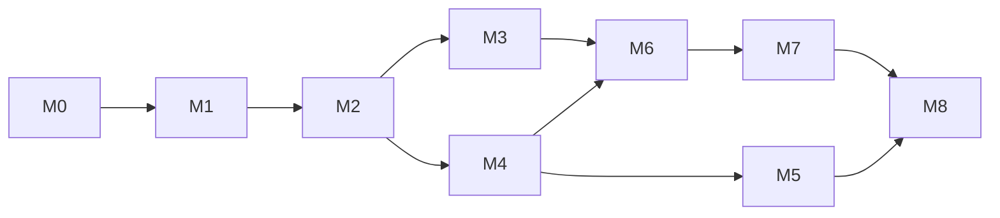

# 15. 実装計画

各マイルストーンは「テストが通った状態で完了」を条件とする。M4 と M5 は並行できる。

## M0. 足場(1 日)

- [x] `go mod init`、`cmd/manager`, `cmd/provider-slack`, `cmd/provider-discord` の骨組み(`version` のみ)
- [x] `proto/asobell/v1/*.proto`(Provider 向け 2 + Console 向け 4 + common)、`buf.yaml`(googleapis / protovalidate 依存)、`buf.gen.yaml`(go / grpc / gateway / openapi)、`buf generate` → `gen/` をコミット。`buf lint` / `buf breaking` を CI に
- [x] `Taskfile.yml`、`.golangci.yml`(`depguard` で manager ⇄ provider の import 禁止)、`.editorconfig`、`.gitignore`
- [x] `compose.dev.yaml`(MongoDB)
- [x] `internal/manager/config`、`internal/provider/config` + テスト
- [x] `internal/shared/rpcauth`(Bearer インターセプタ)+ bufconn テスト
- [x] `internal/manager/testutil`(FakeClock、testcontainers 起動ヘルパー)
- [x] GitHub Actions(`proto`, `go` ジョブ)
- 完了条件: `task check` が緑

## M1. ドメインとストア(2 日)

- [ ] `internal/manager/domain`: Event / Participation / ReminderPolicy / Workspace / ProviderStatus / ChatIdentity / LinkToken / Job と検証ロジック
- [ ] リマインド時刻計算
- [ ] `internal/manager/usecase/ports.go`: Repository / ProviderPort / Clock インターフェース
- [ ] `internal/manager/store/mongo`: 各リポジトリ、`EnsureIndexes`、`UpsertParticipation`、`ClaimJob`、`CancelJobsByEvent`、`ConsumeLinkToken`
- [ ] 契約テスト `storetest` を Mongo 実装に対して実行
- 完了条件: ドメイン単体テスト + Mongo 統合テストが緑

## M2. Manager コア(3 日)

- [ ] `internal/provider/fake`: `fake.ProviderServer`(bufconn 用)
- [ ] `internal/manager/providerclient`: `ProviderPort` の gRPC 実装、ステータス → ドメインエラー変換、`GetInfo` による状態監視と種別照合
- [ ] `internal/manager/bot`: 文言テンプレート、フォーム定義、コマンドディスパッチ、日時・ペースのパース
- [ ] Usecase: Event(Create/Update/End/Cancel/Get/List)、Participation(Join/Peek/Leave/Remove/ExpirePeek)、Reminder、Workspace(ListConnectedWorkspaces / ReportWorkspaces による同期)、ProviderStatus、Identity(IssueLinkToken/Link/Unlink)
- [ ] ジョブハンドラ(`reminder`, `peek_expire`, `event_auto_end`, `archive_channel`)
- [ ] `internal/manager/rpc`: `ManagerService` 実装
- [ ] memstore + fake.ProviderServer による単体・統合テスト(遷移表、冪等性、並行押下、Provider offline)
- 完了条件: usecase のカバレッジ 90% 以上、bufconn 経由の相互呼び出しテストが緑

## M3. スケジューラと Manager 起動(1 日)

- [ ] `internal/manager/scheduler`: ポーリング、claim、backoff、リース更新、graceful stop
- [ ] `internal/manager/app`: 組み立て、起動順序、`manager serve` / `migrate` / `healthcheck`
- [ ] testcontainers による排他・リース切れテスト、再起動後の pending ジョブ実行テスト
- 完了条件: `manager serve` が Mongo だけで起動し、Provider 未接続でも API が応答し、Provider 状態が offline と表示される

## M4. Provider Runtime と Discord(3 日)

- [ ] `internal/provider/adapter`(インターフェース、型、エラー)、`fake.Adapter`、`fake.ManagerServer`
- [ ] `internal/provider/runtime`: Manager 疎通の再試行、`ProviderService` サーバー(`GetInfo` / `ListConnectedWorkspaces` 含む)、インバウンド転送と ACK 制御、EPHEMERAL → DM フォールバック、Health
- [ ] `internal/provider/render`(Message → Discord components / Slack Block Kit の共通部分)
- [ ] `internal/provider/discord`: Adapter 実装、コマンド登録(Guild 限定)、エラー変換、`PIN_MESSAGES` 定数
- [ ] `cmd/provider-discord`
- [ ] Runtime の bufconn テスト、Discord Adapter の `httptest` テスト
- [ ] 手動 E2E(実 Discord サーバー + ローカル Manager)でイベント作成〜終了
- 完了条件: Discord で `/asobell new` → 参加 → `/asobell end` が通る

## M5. Slack(2 日)

- [ ] `internal/provider/slack`: Socket Mode、モーダル(Form 描画)、Block Kit 描画、各メソッド、`PostEphemeral` / DM、エラー変換
- [ ] `cmd/provider-slack`、`deploy/slack-manifest.yaml`
- [ ] `httptest` によるテスト、手動 E2E
- 完了条件: Slack でイベント作成〜終了、`/asobell login` の URL がエフェメラルで届く

## M6. 認証・連携・Console API(3 日)

- [ ] `internal/manager/auth`: Google OIDC ハンドラ、セッション、連携トークン付き初回ログイン、許可リスト、dev login、サービス別の認証インターセプタ
- [ ] protovalidate インターセプタ、ドメインエラー → gRPC ステータス変換(`ErrorInfo` / `BadRequest`)
- [ ] `internal/manager/rpc`: `EventService` / `WorkspaceService` / `AccountService` / `ProviderStatusService` 実装
- [ ] `internal/manager/gateway`: `runtime.ServeMux`(Cookie → metadata、Set-Cookie 転送、エラー JSON)、CSRF・セキュリティヘッダ、`/auth/*`・`/healthz`・SPA を含む `http.ServeMux`
- [ ] bufconn による gRPC テストと `httptest` によるゲートウェイ経由テスト(連携フロー、`mine=true`、`IDENTITY_REQUIRED`、`PROVIDER_UNAVAILABLE`、401/403)
- 完了条件: curl で全 REST エンドポイントが仕様どおり応答し、`gen/openapi/openapi.yaml` が生成される

## M7. WebConsole(3.5 日)

- [ ] Vite + React + TS + Tailwind + shadcn/ui 初期化、ESLint / Prettier / Vitest
- [ ] `gen/openapi/openapi.yaml` から `openapi-typescript` で型生成、API クライアント(`openapi-fetch`)、401 / CSRF middleware、`google.rpc.Status` エラー表示
- [ ] ログイン、連携ページ、レイアウト、ダッシュボード(自分のイベント)
- [ ] イベント一覧・詳細・作成(連携済みワークスペースのみ)・編集、参加者、リマインド
- [ ] Provider 状態、ワークスペース設定、アカウント(連携一覧・解除)
- [ ] コンポーネントテスト、`tsc --noEmit`
- [ ] Go への embed と Dockerfile 統合
- 完了条件: ブラウザで全画面が動作し、WebConsole から作成したイベントがチャットに反映される

## M8. リリース準備(1 日)

- [ ] `deploy/Dockerfile`(3 ターゲット)、`deploy/compose.yaml`、README、`*.env.example`
- [ ] GHCR への 3 イメージ公開ワークフロー
- [ ] Compose での結合テスト(nightly)と手動 E2E チェックリスト全項目
- [ ] ドキュメントと実装の差分を解消

合計目安: 19.5 人日。

## 依存関係

## リスクと対応

| リスク | 対応 |
| --- | --- |
| grpc-gateway の OpenAPI 生成が `oneof` / `optional` を期待どおり表現しない | 生成結果を M0 で確認し、必要なら TS 側に薄い型補正を置く |
| Slack の 3 秒制約と gRPC 往復 | `HandleCommand(new/edit)` は DB 参照 1 回で返す。デッドライン 2.5s 超過時は「もう一度実行してください」を返す |
| アドレス設定ミス(`ASOBELL_PROVIDER_ADDR` / `ASOBELL_MANAGER_ADDR`) | 両側が起動時に疎通を再試行し続け、失敗をログと WebConsole の Provider 状態に表示する |
| discordgo の保守停滞・API 変更 | Adapter に局所化。disgo への差し替えを ADR 0004 に記録 |
| Slack Socket Mode の切断 | `socketmode.Client` の自動再接続に任せ、Health を `NOT_SERVING` に切り替える |
| Discord overwrite 上限 | 参加者 50 名超で WebConsole に警告。ロール方式を将来対応 |
| 連携 URL の横取り | 一度きり・10 分・GET では消費しない・プレビュー抑止・表示名確認(ADR 0009) |
| discordgo の保守停滞が深刻化 | disgo(Apache-2.0)へ Adapter を差し替える(1〜2 人日) |
