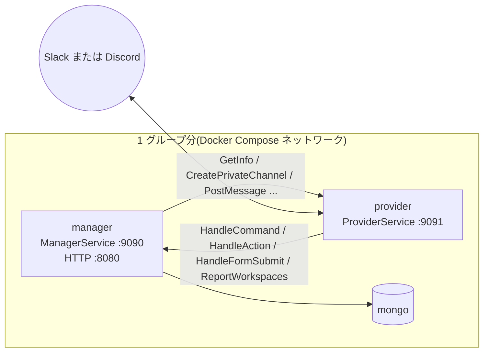
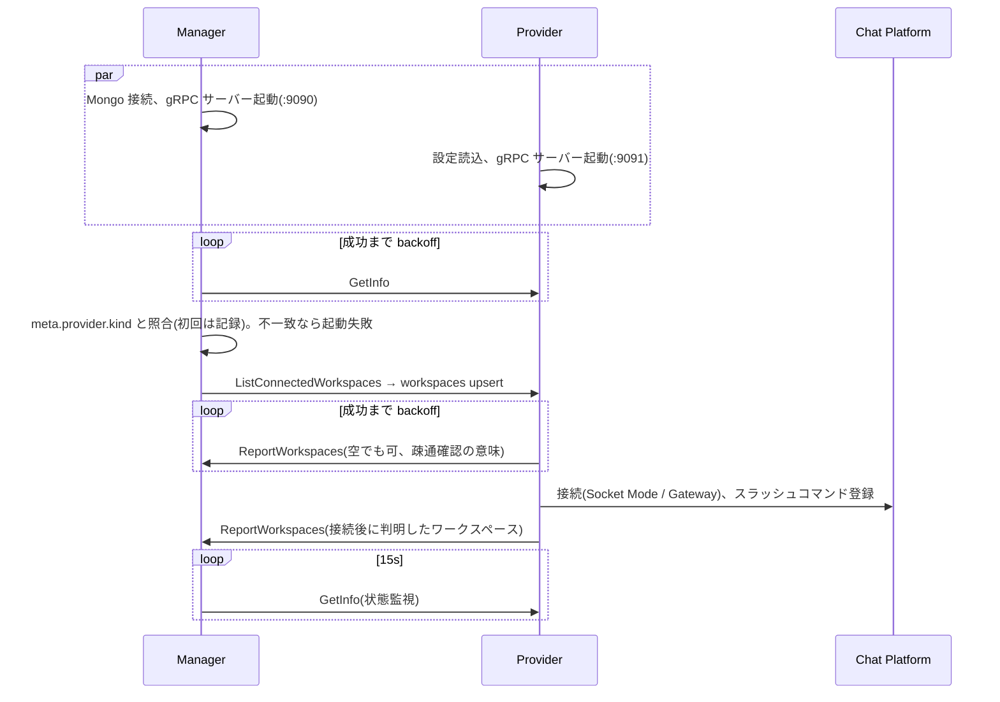

# 16. サービス間通信 (gRPC) 設計

本書は Manager ⇄ Provider 間の契約とライフサイクルを扱う。Manager の gRPC サーバーはこれに加えて WebConsole 向けサービス(`EventService` 等)も同じポートで提供し、grpc-gateway 経由で REST 化する。WebConsole 向けの契約は [08-api.md](08-api.md) を参照。

## 1. トポロジ



- **Manager 1 つに対して Provider は 1 つ**(1:1 のペア)。1 グループは 1 つのチャットツールだけを使う前提で、複数グループに提供する場合はグループごとに Manager + Provider + MongoDB のセットを用意する(→ [adr/0008-grpc-topology.md](adr/0008-grpc-topology.md))
- **双方が gRPC サーバーを持つ**。Provider → Manager はインバウンド(コマンド、ボタン、フォーム、ワークスペース通知)、Manager → Provider はアウトバウンド(チャンネル・メッセージ操作、情報取得)
- アドレスは**双方の環境変数で静的に設定**する(`ASOBELL_PROVIDER_ADDR` / `ASOBELL_MANAGER_ADDR`)。自己登録やサービスディスカバリは行わない
- Manager は起動時と定期的(15 秒)に `GetInfo` を呼び、Provider の種別・能力・接続状態を把握する。連続失敗で `offline` とみなす

## 2. 契約

Protocol Buffers(proto3)で定義し、`buf` で lint・生成・破壊的変更検査を行う。

| ファイル | 内容 |
| --- | --- |
| [proto/asobell/v1/common.proto](../proto/asobell/v1/common.proto) | 共通型: `WorkspaceRef`, `Message`, `Button`, `Form`, `Capabilities` など |
| [proto/asobell/v1/manager.proto](../proto/asobell/v1/manager.proto) | `ManagerService`(Provider → Manager) |
| [proto/asobell/v1/provider.proto](../proto/asobell/v1/provider.proto) | `ProviderService`(Manager → Provider) |
| event / workspace / account / status.proto | WebConsole 向け(→ [08-api.md](08-api.md)) |

生成物は `gen/asobell/v1/` にコミットする(`buf generate`)。パッケージは `asobell.v1`、Go パッケージ名は `asobellv1`。

### 2.1 ManagerService

| RPC | 呼び出し元 | 用途 | デッドライン(Provider 側) |
| --- | --- | --- | --- |
| `ReportWorkspaces` | チャット接続後、Discord `GuildCreate` 等 | ワークスペースの追加・名前変更 | 10s |
| `HandleCommand` | スラッシュコマンド受信時 | コマンド処理。フォームを開く場合は `Reply.open_form` | Slack: 2.5s(trigger_id 失効前に返す)。Discord: 25s(Deferred 後に処理) |
| `HandleAction` | ボタン押下時 | 参加/チラ見処理 | 25s |
| `HandleFormSubmit` | モーダル送信時 | バリデーション(同期)。作成本体は Manager が非同期に実行 | 2.5s |

`HandleCommand` の 2.5 秒デッドラインは Slack の `trigger_id` 制約に由来する。Manager は `new` / `edit` に対しては DB 参照 1 回程度でフォーム定義を返し、重い処理(チャンネル作成など)はフォーム送信後に非同期で行う。Discord のように引数付きで完結するコマンドは、Provider が Deferred 応答したうえで長いデッドラインで呼ぶ。

### 2.2 ProviderService

| RPC | 用途 | 冪等性 |
| --- | --- | --- |
| `GetInfo` | 起動時・定期の疎通確認、種別・能力・接続状態の取得 | ✓ |
| `ListConnectedWorkspaces` | 接続時点で判明しているワークスペースの取得(Manager 起動時の同期) | ✓ |
| `CreatePrivateChannel` | イベントチャンネル作成 | ✗(Manager はリトライしない。失敗時は `provision_failed`) |
| `AddMember` / `RemoveMember` | 参加・除外 | ✓(既存状態なら成功扱い) |
| `ArchiveChannel` | アーカイブ | ✓ |
| `ListChannels` | 募集チャンネル・投稿先の選択肢 | ✓ |
| `PostMessage` | 投稿 | ✗(ジョブ層で再実行する場合は `reminder_logs` で重複判定) |
| `UpdateMessage` | 告知の更新 | ✓ |
| `PostEphemeral` | 本人向け返信(非対応なら DM) | ✗ |
| `SendDirectMessage` | DM | ✗ |
| `PinMessage` / `UnpinMessage` | ピン留め | ✓ |
| `ResolveUser` | 表示名取得 | ✓ |

Manager 側のリトライは冪等な RPC にのみ、service config の `retryPolicy` で `UNAVAILABLE` を対象に最大 3 回行う。非冪等 RPC は `Unavailable` をそのまま呼び出し元へ返し、ジョブ層のリトライに委ねる。

## 3. エラーマッピング

Provider は Slack / Discord のエラーを gRPC ステータスへ変換する。Manager は `status.Code` と `errdetails.ErrorInfo.reason` でドメインエラーへ戻す。

| Provider 内部エラー | gRPC code | `ErrorInfo.reason` | Manager での扱い |
| --- | --- | --- | --- |
| `ErrNotFound` | `NOT_FOUND` | `CHANNEL_NOT_FOUND` / `MESSAGE_NOT_FOUND` / `USER_NOT_FOUND` | 状況に応じて無視または `channel_lost` |
| `ErrAlreadyMember` | (成功) `already_member: true` | – | 成功 |
| `ErrNotMember` | (成功) `was_member: false` | – | 成功 |
| `ErrNameTaken` | `ALREADY_EXISTS` | `NAME_TAKEN` | サフィックス付与で再試行(最大 3 回) |
| `ErrPermission` | `PERMISSION_DENIED` | `BOT_PERMISSION` | 恒久エラー。主催者へ案内 |
| `ErrRateLimited` | `RESOURCE_EXHAUSTED` | `RATE_LIMITED` | ジョブはリトライ、対話は案内 |
| `ErrPinLimit` | `FAILED_PRECONDITION` | `PIN_LIMIT` | 無視して継続 |
| `ErrDMBlocked` | `FAILED_PRECONDITION` | `DM_BLOCKED` | 機微な内容は公開投稿せず、エラーを返す |
| `ErrUnsupported` | `UNIMPLEMENTED` | `UNSUPPORTED` | Capabilities で事前に回避。到達したらバグとしてログ |
| `ErrUnavailable`(5xx、切断、チャット未接続) | `UNAVAILABLE` | `PLATFORM_UNAVAILABLE` | リトライ |
| 入力不正(長さ超過など) | `INVALID_ARGUMENT` | `INVALID_INPUT` | バグとしてログ |
| 認証失敗 | `UNAUTHENTICATED` | – | 設定ミス。ログ |

`ErrorInfo.domain` は `asobell.dev`、`metadata` にプラットフォームの生エラーコード(`slack_error: "name_taken"` 等)を入れる。

## 4. 認証・暗号化

- 共有トークン `ASOBELL_RPC_TOKEN` を両側に設定し、`authorization: Bearer <token>` メタデータで相互認証する(両方向)。サーバー側インターセプタで検証し、不一致は `UNAUTHENTICATED`
- Manager 側のインターセプタはサービス名で認証方式を切り替える。`ManagerService` は RPC トークン、Console 向けサービスはセッショントークン(→ [10-auth-security.md](10-auth-security.md) §2.1)
- Health / Reflection サービスは認証対象外
- TLS: 既定は平文(Compose の内部ネットワーク前提)。`ASOBELL_RPC_TLS_CERT` / `_KEY` / `_CA` を設定すると相互 TLS(mTLS)を有効化する
- トークンはログに出さない

## 5. 接続設定

### 5.1 Manager → Provider(クライアント)

```go
grpc.NewClient(cfg.ProviderAddr, // 例 "dns:///provider:9091"
    grpc.WithTransportCredentials(creds),
    grpc.WithChainUnaryInterceptor(bearerInjector(token), loggingUnary),
    grpc.WithDefaultServiceConfig(providerServiceConfig), // retryPolicy(冪等 RPC のみ)
    grpc.WithKeepaliveParams(keepalive.ClientParameters{Time: 60 * time.Second, Timeout: 20 * time.Second, PermitWithoutStream: true}),
)
```

- `*grpc.ClientConn` は 1 本をプロセス全体で保持する(`NewClient` は I/O を行わないため起動時に必ず作成できる)
- RPC ごとに `context.WithTimeout(ctx, ASOBELL_PROVIDER_TIMEOUT)`(既定 25s)
- `WaitForReady` は使わない(Provider が落ちていれば即 `UNAVAILABLE` を返し、ジョブ層でリトライ)

### 5.2 Provider → Manager(クライアント)

- `ASOBELL_MANAGER_ADDR`(例 `dns:///manager:9090`)へ接続。起動時に `ReportWorkspaces` が成功するまで指数バックオフ(1s〜30s)で再試行し、成功してからチャットツールへ接続する(Manager 未到達の状態でコマンドを受けないため)
- Manager に到達できない間にコマンドを受けた場合、Provider は固定文言「ただいま利用できません」を ephemeral で返す

### 5.3 サーバー共通

- `keepalive.EnforcementPolicy{MinTime: 30s, PermitWithoutStream: true}` をクライアントの `Time: 60s` と整合させる
- `grpc.ChainUnaryInterceptor(recovery, auth, logging)`。recovery は panic を `INTERNAL` に変換
- `health.NewServer()` を登録する。Provider はチャットツール接続断で `NOT_SERVING` に切り替える。Compose の `healthcheck` は各バイナリの `healthcheck` サブコマンド(自プロセスの Health を叩く)で行う
- `GracefulStop` に 10 秒の猶予、超過で `Stop`

## 6. ライフサイクル

### 6.1 起動と種別の固定



- Manager は `GetInfo` が返す `kind` を `meta` コレクションの `provider.kind` に記録する。既に別の種別が記録されている場合(Slack 用 DB に Discord Provider を接続した等)は、ワークスペース ID・ユーザー ID の体系が異なりデータが壊れるため起動を中止する
- どちらが先に起動しても動作する。Manager は Provider 未到達でも HTTP API を提供し、Provider は Manager 未到達の間はチャットツールへ接続しない

### 6.2 状態監視

- Manager は 15 秒ごとに `GetInfo` を呼ぶ。3 回連続失敗、または `connected: false` で `offline` とみなし、`meta.provider.status` と WebConsole 表示を更新する
- Provider の gRPC Health は Compose の再起動判定に使い、Manager の監視は `GetInfo` に統一する(チャット接続状態まで見られるため)

### 6.3 停止

- Provider: SIGTERM でチャット接続を閉じ、処理中のインバウンド RPC の完了を待ち(最大 10 秒)、`GracefulStop`
- Manager: HTTP → Job Worker → gRPC → Mongo の順に停止

### 6.4 Provider offline 時の Manager の挙動

| 操作 | 挙動 |
| --- | --- |
| WebConsole からのイベント作成・終了など | `503 provider-unavailable` |
| ジョブ(リマインド、チラ見期限、アーカイブ) | `UNAVAILABLE` として backoff リトライ。復帰後に実行される |
| チャット経由の操作 | Provider が offline なら届かないので該当なし |

## 7. 相互呼び出しとデッドロック回避

`HandleAction`(Provider → Manager)の処理中に Manager が同じ Provider へ `AddMember`(Manager → Provider)を呼ぶ。Provider の gRPC サーバーは受信ハンドラとは独立した goroutine で動くため、この相互呼び出しはブロックしない。ただし Provider 側でチャットツール API 呼び出しを直列化するロック(レート制限用)を持つ場合、インバウンド処理中にそのロックを保持したまま Manager を呼ばないこと。

## 8. バージョニング

- パッケージ `asobell.v1` を維持し、フィールド追加・RPC 追加は後方互換として同一バージョンで行う
- 破壊的変更は `asobell.v2` を新設し、Manager は一定期間両方を提供する
- CI で `buf breaking --against '.git#branch=main'` を実行する
- `GetInfoResponse.version` と Manager のバージョンをログに出し、非互換の組合せを検出しやすくする

## 9. テスト

- `bufconn` で Manager / Provider の両サーバーをインプロセス起動し、相互呼び出しを含む統合テストを書く(`grpc.NewClient("passthrough:///bufnet", grpc.WithContextDialer(...))`)
- Provider の `ProviderService` 実装は、チャットツール API を `httptest.Server` でスタブして検証
- Manager の Provider クライアントは `ProviderServiceServer` のフェイク実装(`internal/provider/fake`)を bufconn 上で動かして検証
- 種別不一致時の起動中止、`GetInfo` 連続失敗による `offline` 遷移
- インターセプタ(認証、recovery)の単体テスト
